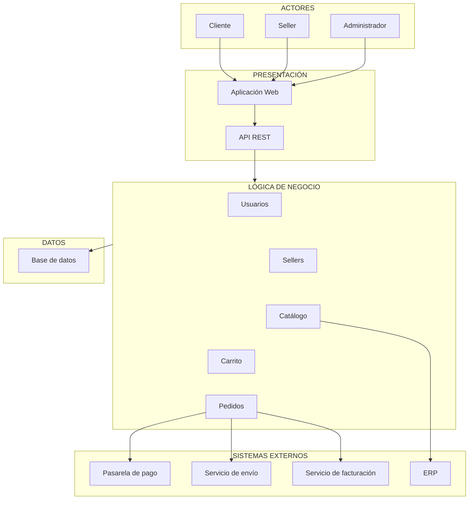

# Arquitectura inicial del sistema

## Diagrama de arquitectura

## Descripción

La arquitectura inicial se organiza en tres capas principales:

### Presentación

Permite la interacción de los usuarios con el sistema mediante la aplicación web y la API REST.

### Lógica de negocio

Contiene los principales módulos responsables de las funcionalidades del sistema:

* Usuarios
* Sellers
* Catálogo
* Carrito
* Pedidos

### Datos

Permite almacenar y consultar la información mediante una base de datos.

### Sistemas externos

El sistema se integra con una pasarela de pago, un servicio de envío, un servicio de facturación y un ERP.
